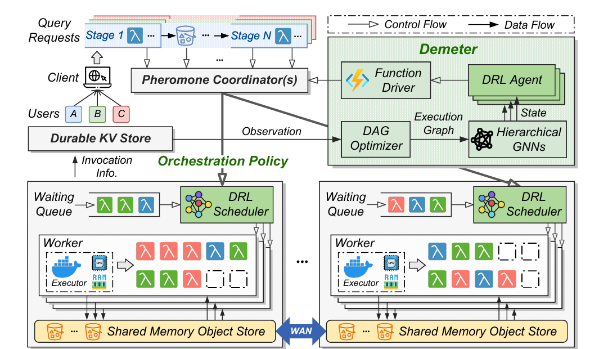

# Demeter: Fine-grained Function Orchestration for Geo-distributed Serverless Analytics

<!-- 

 -->

This repository contains the source code for the paper:

> Demeter: Fine-grained Function Orchestration for Geo-distributed Serverless Analytics, IEEE INFOCOM 2024.

## Overview

<p align="center">
  
</p>

Demeter is a fine-grained function orchestrator for geo-distributed serverless analytics. It targets analytics jobs represented as Directed Acyclic Graphs (DAGs), where each stage contains many short-lived serverless functions that may run near different data centers.
---

## Requirements

### Python Runtime

- Python 3.9+
- `numpy`
- `PyYAML`
- `networkx`
- `pytest` for tests
- `torch` for neural actor/critic and training scaffolding
- `tqdm` for training utilities
- `prometheus-api-client` and `kubernetes` for cluster-side integrations

```bash
pip install -r requirements.txt
pip install -r requirements-dev.txt
```

### Build Dependencies

The `pheromone/` directory is the Pheromone serverless platform tree from *Following the Data, Not the Function: Rethinking Function Orchestration in Serverless Computing*. It provides data buckets, data-triggered function orchestration, and shared-memory data exchange.

Building it requires a Linux-like development environment with:

- CMake
- GNU Make
- `g++` with C++14 support
- Protobuf compiler and development libraries
- ZeroMQ and yaml-cpp dependencies used by Pheromone
- Kubernetes tooling for cluster deployment

---

## Run Simulation

Run the built-in synthetic geo-distributed analytics workload:

```bash
python -m MARL.cli simulate \
  --config configs/demeter.yml \
  --jobs 64 \
  --mode normal \
  --output results/simulation.csv
```

---

## MARL Training

The simulator can run with the lightweight heuristic policy without PyTorch. Neural components are provided in:

- `MARL/networks.py`
- `MARL/training.py`
- `MARL/features.py`

Install PyTorch before using the training scaffold:

```bash
pip install torch tqdm
```
---

## Reference

- [Following the Data, Not the Function: Rethinking Function Orchestration in Serverless Computing](https://arxiv.org/abs/2109.13492)
- [Serverless in the Wild: Characterizing and Optimizing the Serverless Workload at a Large Cloud Provider](https://www.usenix.org/conference/atc20/presentation/shahrad)
- [Resource Allocation in Serverless Query Processing](https://arxiv.org/abs/2208.09519)
- [Astrea: Auto-serverless Analytics Towards Cost-efficient and QoS-aware Data Processing in the Cloud](https://ieeexplore.ieee.org/document/10171385)
